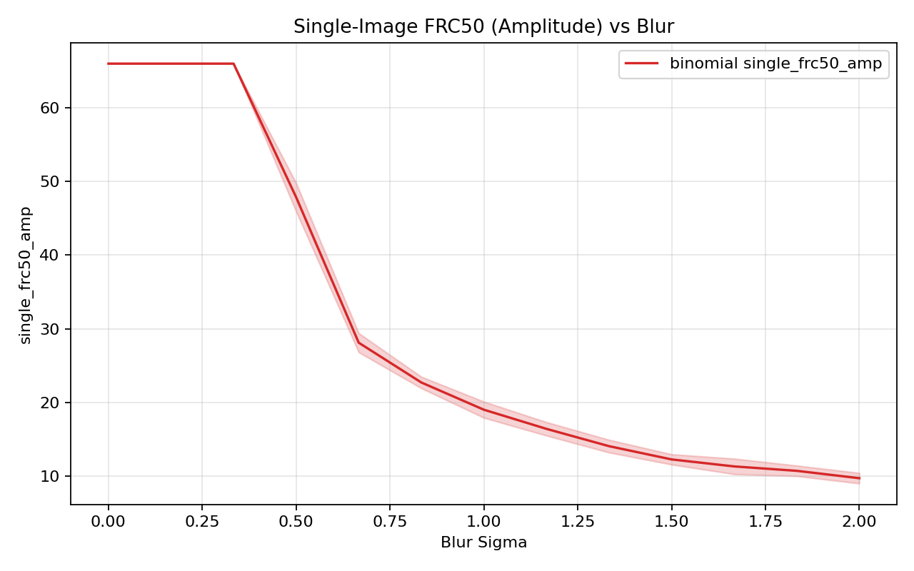
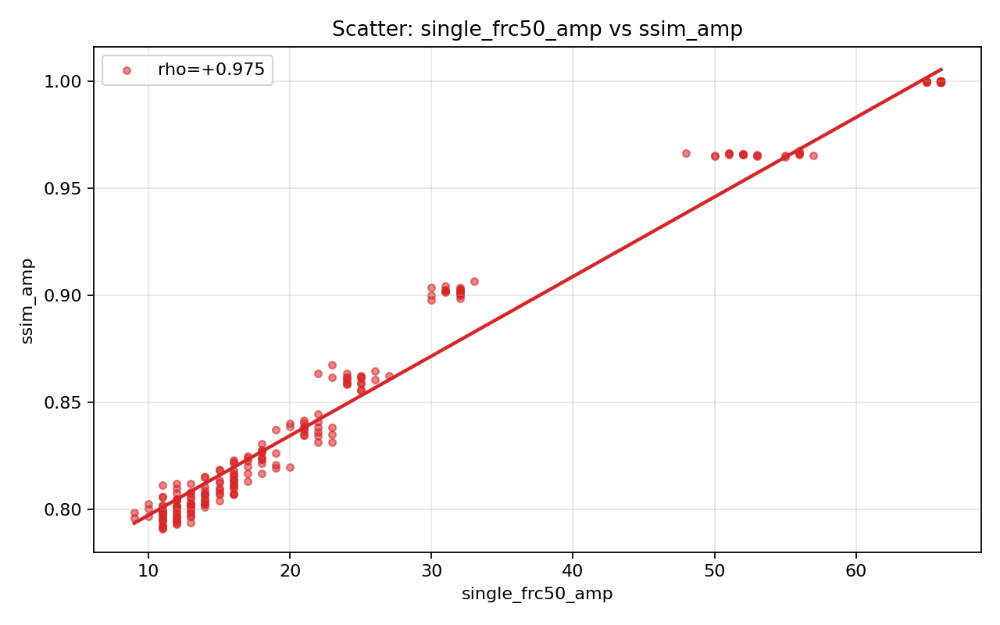
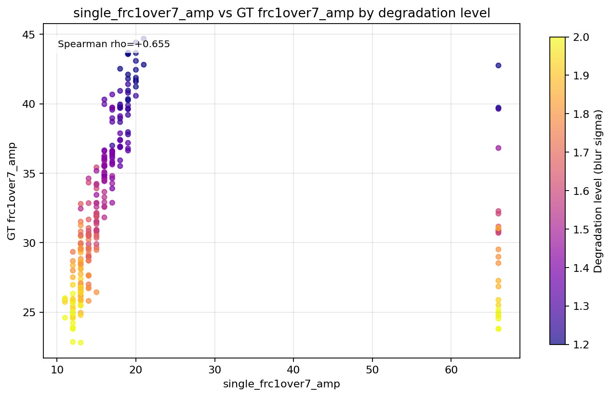

# frc

Utilities for single-image Fourier Ring Correlation (FRC) split construction.

## Installation
```bash
pip install -e .
```

## API
- `center_crop_even_square(arr)`: center-crop to an even square canvas.
- `split_diagonal_interleaved(arr)`: diagonal interleaved split into two half-images.
- `split_binomial_thinned(arr, rng_seed=None, count_scale=4096.0)`: deterministic binomial split.
- `first_below_threshold(curve, threshold)`: first index where a curve falls below threshold.

## Example
```python
import numpy as np

from frc.single_image_frc import (
    center_crop_even_square,
    split_binomial_thinned,
)

img = np.random.rand(96, 96).astype(np.float32)
img = center_crop_even_square(img)

half_a, half_b = split_binomial_thinned(img, rng_seed=123, count_scale=4096.0)
```

## Plot Artifacts
The following plots are generated by the external alignment sweep and saved under `plots/`.

### single_frc50_amp trend


### Scatter (single_frc50_amp vs ssim_amp)


### Scatter by degradation level


### single_frc1over7_amp vs GT frc1over7_amp (by degradation level)


## Data Artifacts
- `raw_metrics.csv`
- `summary.json`
