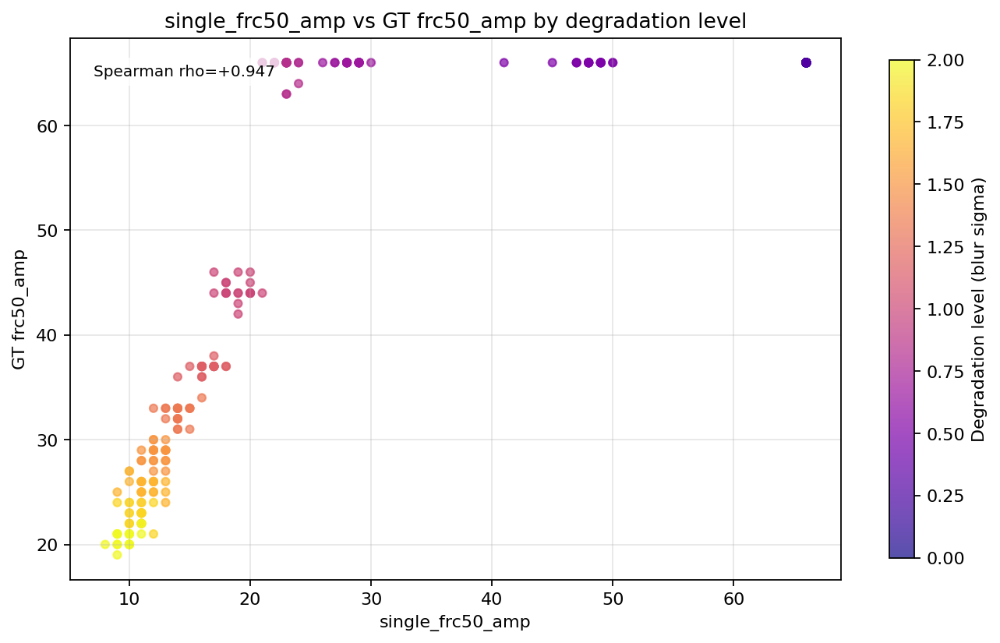

# frc

Utilities for single-image Fourier Ring Correlation (FRC) split construction and analysis outputs.

## Python API
```python
from frc.single_image_frc import (
    center_crop_even_square,
    split_binomial_thinned,
    split_diagonal_interleaved,
    first_below_threshold,
)
```

## Usage
```bash
# Generate/update artifacts under ../frc
python scripts/studies/analyze_single_image_frc_alignment.py

# Optional custom sweep settings
python scripts/studies/analyze_single_image_frc_alignment.py \
  --n-seeds 30 \
  --n-levels 17 \
  --level-max 2.5 \
  --output-dir ../frc
```

Expected outputs:
- `README.md`
- `plots/*.png`
- `raw_metrics.csv`
- `summary.json`

## Example Plots

### single_frc50_amp trend


### Scatter (single_frc50_amp vs ssim_amp)


### Scatter by degradation level


### single_frc50_amp vs GT frc50_amp (by degradation level)


## Artifacts
- Raw metrics: `../frc/raw_metrics.csv`
- Summary JSON: `../frc/summary.json`
